<h1 align="center">Beach Bootcamps</h1>

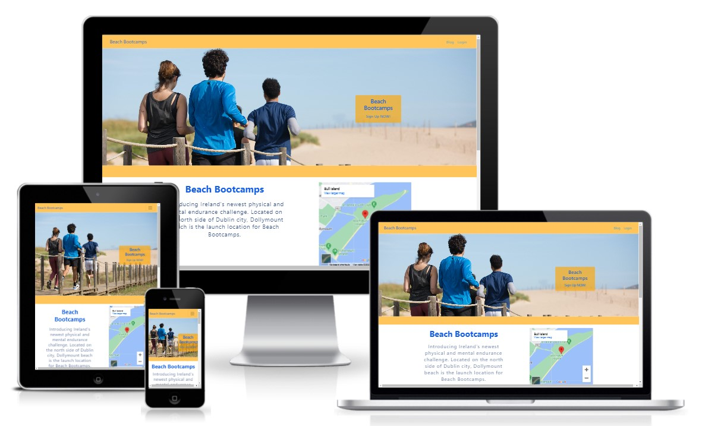

 
Created as part of the Code Institute Portfolio 4: Full Stack Milestone Project 

[Beach Bootcamps](https://beachbootcamp2.herokuapp.com/)

 This website was developed using the full stack framework that includes HTML, CSS, Javascript, Python and Django. This website is for a fictional bootcamp that is to take place on a beach in Dublin, Ireland. The primary objectives of these beach bootcamps are for people to get to excercise as a group in a different type of setting while also making better use of beaches that are empty at various times of the year mainly due to weather conditions. 

***

## UX

### Making a plan

The website should be:
- Easy to use with minimal booking requirements.
- Interactive blog for users to leave feedback/suggestions on a particular bootcamp.

The target audience for beach bootcamps:
- All ages that excercise routinely
- Bootcamps are held in winter on a beach so difficulty level will be increased due to external factors
- Expectation that target audience enjoy physical challenges.

Website users require:
- An informative website that makes it immediately obvious to the user the purpose of the website.
- Easy to Signup and register for a bootamp.
- Ability update registration contact details or delete registration booking.

It is assumed that most users will access the website using a mobile phone. Website responsiveness is a fundamental part of the design and Bootstrap has been used throughout for this purpose.

***

## User Stories
[Defined user stories](https://github.com/users/juliandunne1234/projects/10)

Please find below the acceptance criteria for my user stories. These have been included for info only. It was difficult creating acceptance criteria for the project and ensuring the criteria was met throughout. This was due to certain changes that were made to how the website  functioned, including changing custom models so that the User model played a greater role. Also certain criteria changed due to the level of difficulty. For this reason user stories were changed several times and criteria was removed or <strike>striked</strike> out following the final review.

2. As a Site User I can click on a post so that I can read the full text.
3. As a Site User / Admin I can view comments on an individual post so that I can read the conversation.
4. As a Site User I can create an account so that I can book a space in a bootcamp.
5. As a Site User I can leave comments on a post so that I can be involved in the conversation.
6. As a Site Admin I can create, read, update and delete posts so that I can manage my blog content.
7. As a Site Admin I can create draft posts so that I can finish writing the content later.
8. As a Site Admin I can approve or disapprove comments so that I can filter out objectionable comments.
9. As a Site User I can only sign up for a bootcamp if a space is available so that over booking does not occur.
10. <strike>As a Site User I can only sign up for one bootcamp within a 30 day period so that more people have a chance to attend.</strike>
11. As a Site User I can view a list of posts so that I can select one to read.
12. As a Site User I can register for a bootcamp so that I can participate.

***

## Scope
The website should include:
- Responsive navbar for navigating website pages.
- Landing page with image showing group excercise. 
- A brief introduction to beach bootcamps and information on the types of training.
- Signup/login pages feature using Django allauth
- Blog page with post/comment history that logged in users can join the discussion and leave suggestions/feedback on a given bootcamp.
- Update details page, for registered users to update their registration details which in turn updates the database model.
- Delete registration for users that cannot attend a bootcamp.

***

## Structure
The user should be able to navigate the website with ease. Each page should serve a purpose.

The website contains the following apps:

1. landing page - introduction to beach bootcamps
2. booking - register for a bootcamp
3. blog - logged in users to give feedabck/suggestions on a bootcamp

***

## Databases

### booking
- The booking app database contains 2 custom models. The naming of the models contains the number '13'. This number refers to the number of times that the database migrations folder had to be cleared. The current models are the thirteenth iteration.

### blog
- The blog app database contains 2 models developed using the CodeInstitute course material. The models were slightly modified to suit the requirements of this project. 

***

## Features

### Navigation Bar
The navigation bar is used to access active pages. Page accessibility changes based upon whether a user is logged in.

If the user is not logged in then the navigation bar contains a link to the bootcamp blog to view post and comments and a link to the login page.

If the user has signed up and is logged in the navigation bar contains a link to the bootcamp blog, a link to the bootcamp registration page and a link to the user logout page.

On smaller screens to improve website accessibility the navigation bar collapses to a hamburger icon.

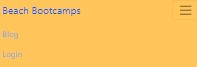

### Footer
The footer displays fictional contact information with links to social media for visual pruposes only.

### Home Page
**Landing image:** User first sees an image of a group of people running on a beach with a link to signup to beach bootcamps. This image was chosen as it looks fun and welcoming, showing a group excerising, running along a beach. When a user is logged in the "Sign Up Now" link displayed is hidden.

**Introduction with Bootcamp Location**: Brief introduction including bottcamp location with map.

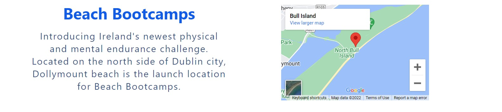

**Bootcamp Blog Link**: Reason for creating the bootcamp blog with link styled as a button taking the user to the blog page.

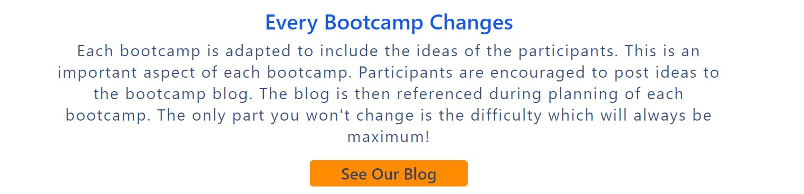

**4 Types of Excercise**: Introduce the four different types of excercise that the bootcamp is developed around. Image and description included.

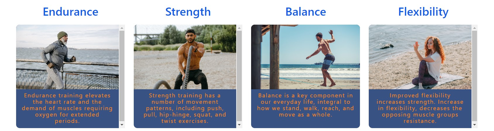

### Account Authorisation
**Login Page**: The user enters their username and password to login. If the user does not have an account then there is also a sign up link.

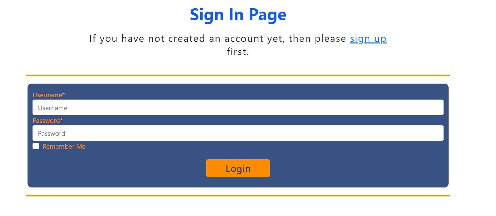

**Sign Up Page**: The user enters a unique username and the password must be entered twice correctly to confirm. Entering an email is optional at this stage as it is only required when registering for a bootcamp.

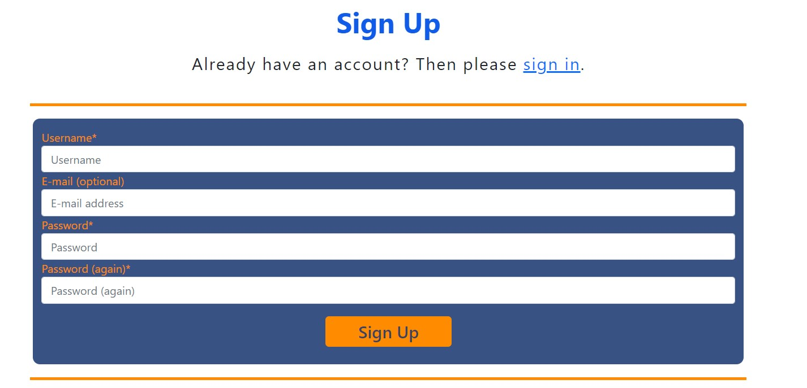

**Logout Page**: The user selects the logout link in the header and confirms logout.

### Registration
**Bootcamp Booking Form**: This page includes a bootcamp booking form where the user must be logged in to submit the form. The form has email and bootcamp date fields. These details along with the logged in users username is used to populate the bootcamp model.

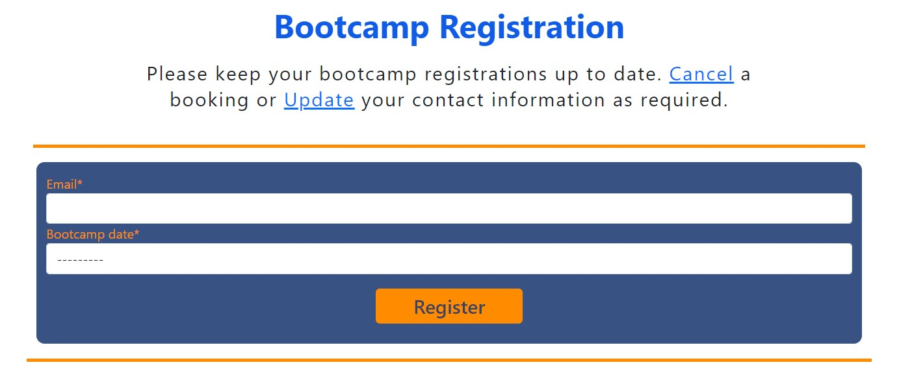

**Cancel Registration**: If a user has registered for a bootcamp but cannot attend then registration can be cancelled.

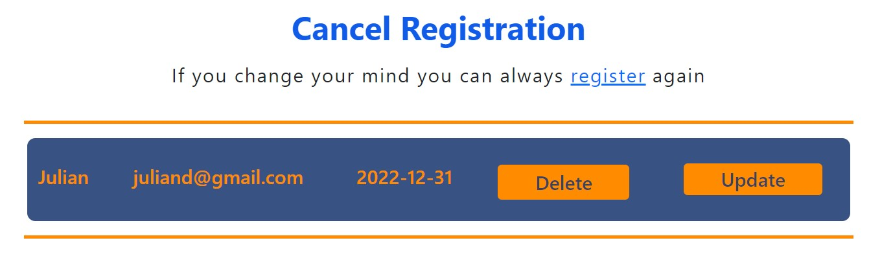

**Update Registration**: If a user needs to update their contact detials which is by email.

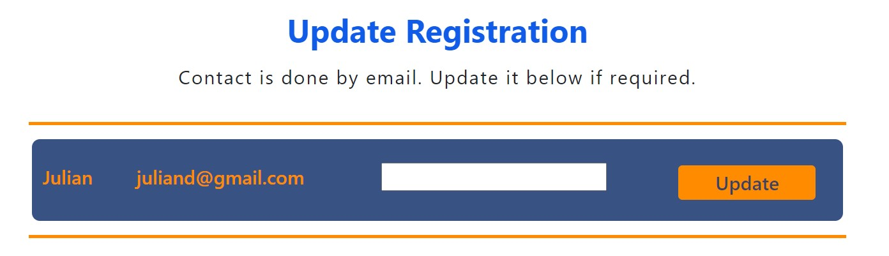

### Bootcamp Blog
**Bootcamp Admin Post**: Taken form the CodeInstitute course material. The purpose of the blog post is that for a particular bootcamp the admin user creates a post with information on the applicable bootcamp to start the discussion.

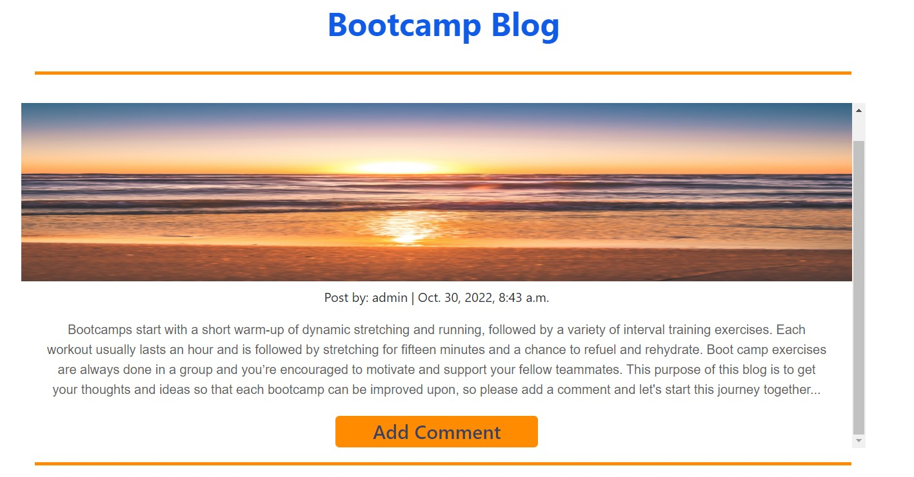

**Blog Comments**: Taken form the CodeInstitute course material. Logged in users have the ability to add comments to a bootcamp post. The purpose of this is for participants to get involved in shaping the bootcamp and providing feedback on their bootcamp experience.

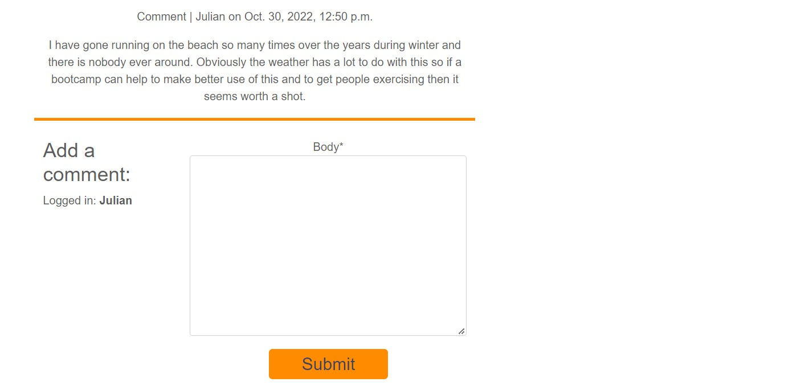

***

## Technologies Used

Languages, libraries and frameworks used during the development of this website:

- [Django](https://www.djangoproject.com/)
    - Django is the framework used to build the project and each of the apps.
- [Python](https://www.python.org/)
    - Python is the programming language used to write the code in each app.
- [Bootstrap](https://getbootstrap.com/)
    - Library used for creating responsive websites.
- [Google Fonts](https://fonts.google.com/)
    - Required for fonts used throughout website 
- [Font Awesome](https://fontawesome.com/)
    - Library that contains social media icons among others.
- [Google Developer Tools](https://developers.google.com/web/tools/chrome-devtools)
    - Used while fixing spacing issues, finding bugs, and testing webpage responsiveness.
- [GitHub](https://github.com/)
    - Used to store code for the project after being pushed.
- [Git](https://git-scm.com/)
    - Used for version control by utilising the Gitpod terminal to commit to Git and Push to GitHub.
- [Gitpod](https://www.gitpod.io/)
    - Used as the development environment.
- [Heroku](https://dashboard.heroku.com/apps)
    - Used to deploy the application.
- [Cloudinary](https://cloudinary.com/)
    - Used to store static files and images.
- [Favicon.io](https://favicon.io/)
    - Used to create favicon's for my website
- [W3C Markup Validation Service](https://validator.w3.org/) 
    - Used to validate all HTML code written and used in this webpage.
- [W3C CSS Validation Service](https://jigsaw.w3.org/css-validator/)
    - Used to validate all CSS code written and used in this webpage.
- [AmIResponsive](http://ami.responsivedesign.is/)
    - Used to generate responsive images used in README file.
- [PostgreSQL](https://www.postgresql.org/)
    - Heroku's PostgreSQL relational database used in deployment to store the data for each model.

***

## Validator Testing
* HTML - errors are present but each error is either due to template inheritance or the django framework code syntax when passing values to HTML pages.

* CSS - no errors found.

* Accessibility - Website accessibility is an important part of website development. Devtools Lighthouse was used to compare the home page and the sign up page as it was observed during testing that the homepage load time was significantly longer than the other pages.

    * Homepage
    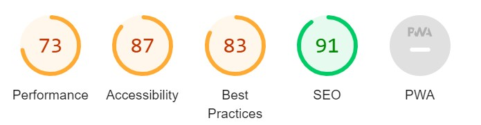

    * Sign Up page
    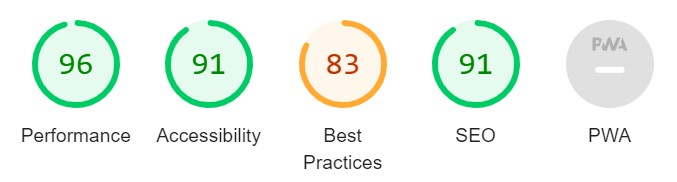
***

## Deployment
- The beach bootcamp app has been deployed to [Heroku](https://www.heroku.com/) - a cloud platform service for developers to build and run applications: 
    - Live link - [Beach Bootcamp](https://beachbootcamp2.herokuapp.com/)

***

## Credits
- I Think Therefore I Blog walkthrough project with Code Institute was very helpful to use as a starting point for this project.
- Tutor support was also very helpful and advice taken from mentor sessions was used during development of the app
- Online resources including [python documenation](https://docs.python.org/3/library/dataclasses.html).
- Bootstrap online documentation [Bootstrap](https://getbootstrap.com/)
